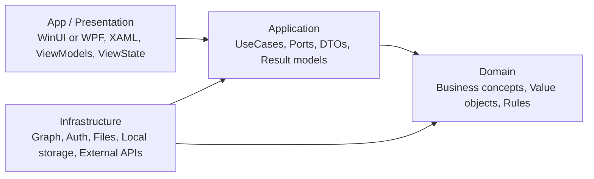

# .NET Desktop Agent Kit

[English README](README.md)

**.NET Desktop Agent Kit은 WinUI/WPF 데스크톱 앱에서 MVVM, MVI 스타일 상태 흐름, Clean Architecture, Roslyn MCP 기반 리팩토링을 AI 코딩 에이전트에게 강제하기 위한 복사용 스킬 킷입니다.**

이 레포는 샘플 앱도 아니고 단순 프롬프트 모음도 아닙니다. Codex CLI, Claude Code, Cursor, OpenCode 같은 도구가 C# 데스크톱 앱을 수정할 때 같은 실수를 반복하지 않도록 rules, skills, agents, workflows, templates, docs 형태로 아키텍처 기준을 정리한 공개용 킷입니다.

## 왜 필요한가

많은 .NET 아키텍처 자료는 ASP.NET Core, Minimal API, EF Core, 백엔드 Clean Architecture 중심입니다. 하지만 데스크톱 앱에는 다른 문제가 자주 생깁니다.

- XAML code-behind에 업무 로직이 조용히 쌓입니다.
- ViewModel이 서비스 로케이터나 통합 허브처럼 비대해집니다.
- 화면 상태가 하나의 ViewState가 아니라 여러 mutable flag로 흩어집니다.
- Microsoft Graph, 파일, 인증, 로컬 저장소, 외부 SDK DTO가 Presentation 계층까지 새어 나옵니다.
- 리팩토링 중 binding, command lifetime, cancellation, UI thread 전제가 쉽게 깨집니다.

이 킷은 에이전트가 작업 전에 읽고 따를 수 있는 데스크톱 특화 실행 지침입니다. 단순 scaffold가 아니라 계획, 범위 제한된 구현, 감사, 검증까지 반복 가능한 흐름을 지원합니다.

## `dotnet-claude-kit`과의 차이

[`codewithmukesh/dotnet-claude-kit`](https://github.com/codewithmukesh/dotnet-claude-kit)은 skills, agents, rules, templates, knowledge, verification workflow를 구조화하는 방식에서 좋은 참고 대상입니다. 이 레포는 그 구조적 장점을 참고하되 백엔드 중심 내용을 그대로 가져오지 않습니다.

| 구분 | `dotnet-claude-kit` 성격 | 이 킷의 방향 |
|---|---|---|
| 주 대상 | ASP.NET Core, API, service | WinUI 3, WPF 데스크톱 앱 |
| 핵심 문제 | HTTP endpoint, persistence, backend architecture | code-behind, ViewModel 비대화, UI 상태 흐름, 데스크톱 통합 |
| 통합 예시 | EF Core, API, backend infrastructure | Microsoft Graph/M365, 인증, 파일, 로컬 저장소, 외부 데스크톱 adapter |
| Presentation 가이드 | 웹/API 중심 | MVVM + MVI 스타일 Intent/Result/ViewState 루프 |
| 분석 방식 | 일반 .NET 검증 | Roslyn MCP 우선의 의미 기반 desktop layering/SDK leakage 감사 |

## 적용 대상

- **WinUI 3** 앱을 만들거나 리팩토링할 때
- **WPF** 앱을 만들거나 리팩토링할 때
- **CommunityToolkit.Mvvm** 또는 유사 MVVM toolkit을 사용할 때
- MVVM을 유지하면서 MVI 스타일의 명시적 상태 흐름을 도입하고 싶을 때
- Microsoft Graph/M365, 로컬 파일, 인증, 저장소, 외부 API와 통합하는 데스크톱 앱일 때
- Codex CLI 같은 에이전트에게 명확한 아키텍처 기준을 주고 싶을 때

**Avalonia**는 향후 선택적 대상으로만 다룹니다. 현재 기준은 WinUI/WPF 우선입니다.

## 비적용 대상

- ASP.NET Core backend-only 프로젝트
- EF Core CRUD API 템플릿 생성
- full DDD framework 도입
- 회사명, tenant ID, client secret, 사내 URL, 내부 프로젝트명 보관

## 아키텍처 원칙

WinUI/WPF App은 얇게 유지합니다. ViewModel은 UI 상태와 Intent를 담당합니다. 업무 흐름은 Application UseCase로 이동합니다. Graph/M365, 파일, 로컬 저장소, 인증, 외부 API는 Infrastructure adapter 뒤로 격리합니다.



의존성 방향은 다음을 유지합니다.

```text
App -> Application -> Domain
Infrastructure -> Application / Domain
Domain -> no external dependencies
```

## MVVM 안에서의 MVI 스타일 상태 흐름

MVVM/MVI는 Clean Architecture와 경쟁하는 개념이 아닙니다. MVVM은 데스크톱 Presentation 구조를 제공하고, MVI 스타일 흐름은 상태 전이를 명시하며, Clean Architecture는 앱 전체의 의존성/책임 경계를 통제합니다.

```text
View -> Command / Intent -> ViewModel -> UseCase -> Port -> Infrastructure Adapter -> Result -> Reducer / State update -> ViewState -> View
```

## 저장소 구성

```text
AGENTS.md                         메인 에이전트 운영 원칙
CLAUDE.md                         Claude Code 진입점
.codex/AGENTS.md                  Codex CLI 진입점
rules/                            항상 적용할 아키텍처 규칙
skills/*/SKILL.md                 작업별 재사용 스킬
agents/*.md                       전문 subagent 정의
workflows/*.md                    단계별 Codex/agent 작업 흐름
templates/                        복사용 프로젝트 템플릿
docs/concepts/                    개념 설명
docs/adr/                         아키텍처 결정 기록
docs/examples/                    작고 generic한 예시
.github/                          issue/PR 템플릿
```

## 실행 표면

이 킷은 여러 파일이 같은 방향을 가리키도록 구성합니다.

- `AGENTS.md`와 `.codex/AGENTS.md`는 Codex 및 다른 코딩 에이전트의 운영 규칙을 정의합니다.
- `CLAUDE.md`, `.opencode/AGENTS.md`, Cursor rule은 같은 지침을 다른 도구에서 쓰기 위한 진입점입니다.
- `rules/`는 데스크톱 코드에 항상 적용할 아키텍처 제약입니다.
- `workflows/`는 feature work, refactoring, parallel-wave audit, runtime smoke, PR 준비, 검증 절차입니다.
- `skills/`는 app-edge boundary, result taxonomy, reducer/store design, composition/DI, Roslyn MCP audit 같은 반복 작업 가이드입니다.
- `agents/`는 architecture, refactoring, Graph integration, quality audit, testing, UI state review, documentation, build fix 전문 agent 정의입니다.

## Quick start

1. 데스크톱 앱 레포 루트에 `AGENTS.md`를 복사합니다.
2. Codex CLI를 쓰면 `.codex/AGENTS.md`를 함께 복사합니다.
3. 강제하고 싶은 규칙을 `rules/`에서 고릅니다.
4. 작업 종류에 맞는 skills와 workflows를 복사합니다.
5. WinUI는 `templates/AGENTS.winui.md`, `templates/CODEX.winui.AGENTS.md`에서 시작합니다.
6. WPF는 `templates/AGENTS.wpf.md`에서 시작합니다.
7. 첫 요청에는 사용할 workflow와 대상 screen/feature를 명시합니다.

## Codex CLI 사용법

`.codex/AGENTS.md`는 Codex CLI용 routing 파일입니다. Codex가 먼저 root `AGENTS.md`를 읽고, Roslyn MCP가 있으면 의미 기반 분석을 우선하며, Windows 데스크톱 레포에서 bash-only hook을 기본값으로 강제하지 않도록 안내합니다.

## Claude Code, Cursor, OpenCode 사용법

- Claude Code: `CLAUDE.md`와 필요한 `skills/*/SKILL.md`를 함께 사용합니다.
- Cursor: 필요한 rule 파일을 Cursor rules 구성에 복사하거나 `templates/rule-template.md`로 변환합니다.
- OpenCode: root `AGENTS.md` 스타일 지침과 workflow 문서를 작업 프롬프트로 사용합니다.

## Roslyn MCP 권장 방식

Roslyn MCP 서버가 있으면 project graph, symbol reference, port implementation, circular dependency, diagnostics, dead code, public API surface, ViewModel의 Graph SDK 참조, Application/Domain의 WinUI/WPF 참조, Infrastructure DTO의 ViewState 유출을 확인합니다.

## Microsoft Graph/M365 adapter 원칙

Graph SDK는 Infrastructure에만 둡니다. Application은 `ICalendarGateway`, `IPlannerGateway`, `ITodoGateway`, `IUserProfileGateway`, `IAuthTokenProvider` 같은 port만 봅니다. ViewModel은 Graph client가 아니라 UseCase를 호출합니다. raw SDK exception은 throttled, permission denied, token expired, network unavailable 같은 application-level error로 변환합니다.

## App-edge와 Result 원칙

Window, XAML, dialog, focus, clipboard, file picker, process launch, shell integration, native handle, interactive auth 권한은 App edge에 둡니다. raw WinUI/WPF 타입, `Window`, `XamlRoot`, HWND, platform handle을 ViewModel, Application, Domain으로 밀어 넣지 않습니다.

사용자에게 보이는 작업은 plain `bool`, raw `Exception`, direct `exception.Message` 대신 typed result model을 사용합니다. Result에는 action kind, status/severity, machine-readable failure reason, retry/reload/stale/cancelled/partial-success 힌트, optional diagnostics reference를 담을 수 있어야 합니다.

## Roadmap

- v0.2: desktop-first rules, skills, agents, workflows, templates, docs 확장
- v0.3: CommunityToolkit.Mvvm, navigation, dialog, design-time state에 대한 WinUI/WPF 예시 강화
- v0.4: WinUI/WPF 범위가 안정된 후 optional Avalonia 노트 추가
- v1.0: 반복 가능한 agent onboarding용 안정된 공개 킷 레이아웃

## License

MIT
