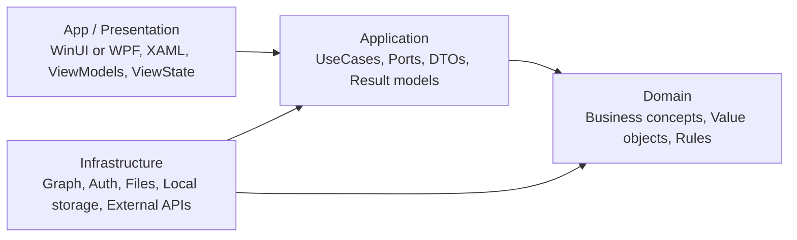
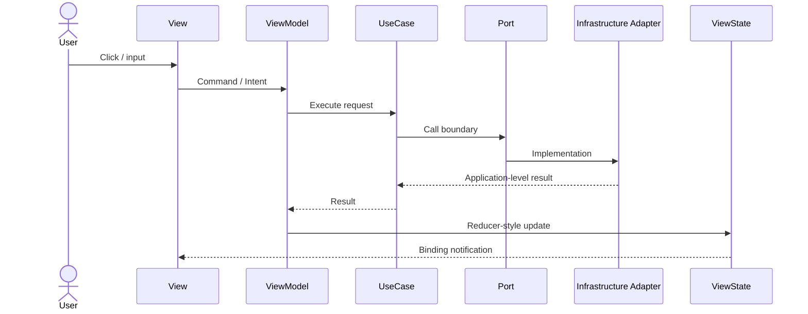

# .NET Desktop Agent Kit

[한국어 README](README.ko.md)

**.NET Desktop Agent Kit is a copyable AI coding-agent skill kit for WinUI/WPF desktop apps that use MVVM, MVI-style state flow, Clean Architecture, and Roslyn MCP-assisted refactoring.**

This repository is not a sample application and not a prompt dump. It is a public-safe set of rules, skills, agents, workflows, templates, and architecture notes that can be copied into another C# desktop application so Codex CLI, Claude Code, Cursor, and OpenCode make consistent architecture decisions.

## Why this exists

Most .NET agent kits and Clean Architecture examples are optimized for ASP.NET Core, Minimal APIs, EF Core, and backend systems. Desktop apps fail in different places:

- XAML code-behind quietly accumulates business logic.
- ViewModels become service locators or integration hubs.
- UI state spreads across mutable flags instead of one explicit ViewState.
- Microsoft Graph, file, auth, local storage, and external SDK DTOs leak into Presentation.
- Refactors break bindings, commands, cancellation paths, and UI-thread assumptions.

This kit gives agents desktop-specific guardrails before they edit code. It is meant to support planning, scoped implementation, audit, and verification, not just initial scaffolding.

## How this differs from `dotnet-claude-kit`

[`codewithmukesh/dotnet-claude-kit`](https://github.com/codewithmukesh/dotnet-claude-kit) is a strong reference for structuring skills, agents, rules, templates, knowledge, and verification workflows. This repository borrows the structure, not the backend content.

| Area | `dotnet-claude-kit` style | This kit |
|---|---|---|
| Primary app type | ASP.NET Core, APIs, services | WinUI 3 and WPF desktop apps |
| Main pressure point | HTTP endpoints, persistence, backend architecture | code-behind, ViewModel overreach, UI state flow, desktop integrations |
| Integration examples | EF Core, APIs, backend infrastructure | Microsoft Graph/M365, auth, files, local storage, external desktop adapters |
| Presentation guidance | Web/API oriented | MVVM plus MVI-style Intent/Result/ViewState loop |
| Analysis expectation | General .NET verification | Roslyn MCP-first semantic audits for desktop layering and SDK leakage |

## Apply this kit when

- You are building or refactoring a **WinUI 3** app.
- You are building or refactoring a **WPF** app.
- Your app uses **CommunityToolkit.Mvvm** or a similar MVVM toolkit.
- You want MVI-style state flow without abandoning MVVM.
- Your desktop app integrates with **Microsoft Graph/M365**, local files, auth, storage, or external APIs.
- You want Codex CLI or another coding agent to follow explicit architecture rules.

**Avalonia** is an optional future target. The current guidance is WinUI/WPF-first.

## This kit is not for

- ASP.NET Core backend-only projects.
- EF Core CRUD API template generation.
- Full DDD framework adoption.
- Storing company-specific prompts, tenant IDs, client secrets, internal URLs, or private project names.

## Architecture doctrine

Keep the WinUI/WPF app thin. Let ViewModels own UI state and intents. Move business/application flow into Application UseCases. Put Graph/M365, files, local storage, auth, and external APIs behind Infrastructure adapters.



Dependency direction:

```text
App -> Application -> Domain
Infrastructure -> Application / Domain
Domain -> no external dependencies
```

## MVI-style state flow inside MVVM

MVVM and MVI are not competing with Clean Architecture. MVVM supplies the desktop Presentation structure, MVI-style flow makes state transitions explicit, and Clean Architecture controls dependency boundaries across the whole app.



Default flow:

```text
View -> Command / Intent -> ViewModel -> UseCase -> Port -> Infrastructure Adapter -> Result -> Reducer / State update -> ViewState -> View
```

## Repository map

```text
AGENTS.md                         Main operating doctrine for agents
CLAUDE.md                         Claude Code entrypoint
.codex/AGENTS.md                  Codex CLI entrypoint
rules/                            Always-on architecture rules
skills/*/SKILL.md                 Reusable task skills
agents/*.md                       Specialist subagent definitions
workflows/*.md                    Step-by-step Codex/agent workflows
templates/                        Copyable project templates
docs/concepts/                    Concept explanations
docs/adr/                         Architecture decision records
docs/examples/                    Small generic examples
.github/                          Issue and PR templates
```

## Execution surfaces

Use the kit as a set of coordinated surfaces:

- `AGENTS.md` and `.codex/AGENTS.md` define operating rules for Codex and other coding agents.
- `CLAUDE.md`, `.opencode/AGENTS.md`, and Cursor rules give other tools lightweight entrypoints into the same guidance.
- `rules/` contains always-on architectural constraints for desktop code.
- `workflows/` contains repeatable procedures for feature work, refactoring, parallel-wave audits, runtime smoke checks, PR preparation, and verification.
- `skills/` contains callable task guides for common desktop architecture work, including app-edge boundaries, result taxonomy, reducer/store design, composition/DI, and Roslyn MCP audits.
- `agents/` defines specialist agents for architecture, refactoring, Graph integration, quality audit, testing, UI state review, documentation, and build fixes.

## Quick start

1. Copy `AGENTS.md` into the root of your desktop app repository.
2. Copy `.codex/AGENTS.md` if you use Codex CLI.
3. Copy the rules you want enforced from `rules/`.
4. Copy the skills and workflows that match the work you ask the agent to perform.
5. For WinUI, start from `templates/AGENTS.winui.md` and `templates/CODEX.winui.AGENTS.md`.
6. For WPF, start from `templates/AGENTS.wpf.md`.
7. In your first agent request, name the workflow and the affected screen or feature.

Example prompt:

```text
Read AGENTS.md and .codex/AGENTS.md.
Use workflows/add-feature.md with agents/dotnet-desktop-architect.md.
Add a generic Calendar screen. Keep Graph behind an Application port and Infrastructure adapter.
Report changed files, architecture impact, verification, and risks.
```

## Codex CLI usage

Use `.codex/AGENTS.md` as the Codex-specific routing file. It tells Codex to read root `AGENTS.md` first, prefer Roslyn MCP semantic checks when available, and avoid bash-only assumptions in Windows desktop repositories.

## Claude Code, Cursor, and OpenCode usage

- Claude Code: use `CLAUDE.md` plus selected `skills/*/SKILL.md` files.
- Cursor: copy relevant `rules/*.md` into your Cursor rules setup or adapt `templates/rule-template.md`.
- OpenCode: use root `AGENTS.md` and `workflows/*.md` as task prompts.

## Rules, skills, agents, workflows

| Task | Agent | Skills | Rules | Workflow |
|---|---|---|---|---|
| Add a screen feature | `agents/dotnet-desktop-architect.md` | `skills/feature-planning/SKILL.md`, `skills/usecase-design/SKILL.md`, `skills/viewstate-design/SKILL.md` | `rules/architecture-boundaries.md`, `rules/mvi-state-flow.md` | `workflows/add-feature.md` |
| Refactor a ViewModel | `agents/mvvm-mvi-refactorer.md` | `skills/mvvm-mvi-refactoring/SKILL.md`, `skills/screen-refactoring/SKILL.md` | `rules/viewmodel-responsibility.md`, `rules/usecase-boundaries.md` | `workflows/refactor-screen.md` |
| Add Graph integration | `agents/graph-integration-specialist.md` | `skills/graph-adapter/SKILL.md`, `skills/usecase-design/SKILL.md` | `rules/infrastructure-adapters.md`, `rules/public-repo-safety.md` | `workflows/add-graph-integration.md` |
| Audit a refactor | `agents/quality-auditor.md` | `skills/roslyn-mcp-audit/SKILL.md`, `skills/verification/SKILL.md` | `rules/verification.md`, `rules/testing-strategy.md` | `workflows/audit-architecture.md` |
| Broad multi-area refactor | `agents/quality-auditor.md` plus scoped specialists | `skills/roslyn-mcp-audit/SKILL.md`, `skills/verification/SKILL.md` | `rules/parallel-wave.md`, `rules/error-learning.md` | `workflows/parallel-wave.md` |
| Runtime smoke check | `agents/quality-auditor.md` | `skills/verification/SKILL.md` | `rules/app-edge-boundaries.md`, `rules/verification.md` | `workflows/runtime-smoke.md` |

## Roslyn MCP recommendation

When a Roslyn MCP server is available, use semantic analysis before broad text edits: project graph, symbol references, port implementations, circular dependencies, diagnostics, dead code, public API surface, ViewModel Graph SDK references, Application/Domain UI references, and Infrastructure DTO leakage into ViewState.

See `docs/concepts/roslyn-mcp-for-desktop-refactoring.md`, `skills/roslyn-mcp-audit/SKILL.md`, and `workflows/audit-architecture.md`.

## Microsoft Graph/M365 adapter stance

Graph SDK usage belongs in Infrastructure only. Application code should see ports such as `ICalendarGateway`, `IPlannerGateway`, `ITodoGateway`, `IUserProfileGateway`, and `IAuthTokenProvider`. ViewModels should call UseCases, not Graph clients. Raw SDK exceptions should be converted into application-level error models such as throttled, permission denied, token expired, network unavailable, or unknown external failure.

## App-edge and result stance

Window, XAML, dialog, focus, clipboard, file picker, process launch, shell integration, native handle, and interactive auth authority belongs at the App edge. Do not push raw WinUI/WPF types, `Window`, `XamlRoot`, HWND, or platform handles into ViewModels, Application, or Domain.

User-visible operations should use typed result models rather than plain `bool`, raw `Exception`, or direct `exception.Message` strings. Results should carry action kind, status or severity, machine-readable failure reason, retry/reload/stale/cancelled/partial-success hints when relevant, and optional diagnostics references.

## Public contribution summary

Contributions should improve generic, desktop-first agent behavior. Do not include company names, tenant IDs, client secrets, private URLs, internal project names, screenshots with private data, or non-public Microsoft 365 details. See `CONTRIBUTING.md`, `SECURITY.md`, and `.github/PULL_REQUEST_TEMPLATE.md`.

## Roadmap

- v0.2: desktop-first rules, skills, agents, workflows, templates, and docs.
- v0.3: richer WinUI/WPF examples for CommunityToolkit.Mvvm, navigation, dialogs, and design-time state.
- v0.4: optional Avalonia notes after WinUI/WPF coverage is stable.
- v0.5: validation scripts for link and structure checks.
- v1.0: stable public kit layout for repeatable agent onboarding.

## License

MIT
